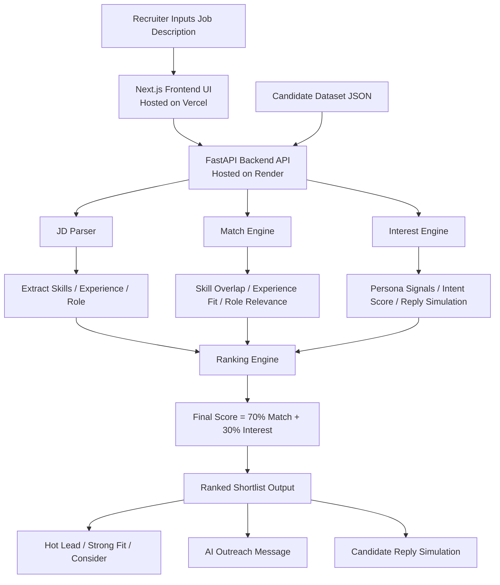

# ScoutX AI 🚀
### AI-Powered Talent Scouting & Engagement Agent

> ScoutX AI helps recruiters move from **Job Description to ranked shortlist in minutes.**
> Instead of manually screening resumes, sourcing profiles, and chasing candidate interest, ScoutX uses AI-driven scoring to identify the best-fit candidates and estimate their likelihood of engaging.

[](https://scoutx-ai.onrender.com)
[](https://vercel.com)
[](https://github.com/vijaymoka/scoutx-ai)

---

## 🌟 Problem Statement

Recruiters spend hours:

- 📄 Parsing job descriptions manually
- 🔍 Searching through candidate databases
- 🔁 Comparing profiles one by one
- 📬 Following up with low-response candidates
- ⏱️ Losing time on unqualified leads

**ScoutX AI solves this by automating the entire first layer of hiring intelligence.**

---

## 💡 What ScoutX AI Does

Input a **Job Description**. ScoutX AI automatically:

| Step | Action |
|------|--------|
| ✅ | Parses required skills, experience, and role signals |
| ✅ | Scans candidate dataset |
| ✅ | Calculates **Match Score** |
| ✅ | Simulates candidate intent / engagement likelihood |
| ✅ | Calculates **Interest Score** |
| ✅ | Generates personalized outreach messages |
| ✅ | Simulates candidate responses |
| ✅ | Produces **ranked shortlist instantly** |

---

## 🏗️ Architecture



---

## 🏆 Core Output

Each candidate receives:

| Output | Description |
|--------|-------------|
| **Match Score** | How well the profile matches the JD |
| **Interest Score** | Predicted willingness to engage |
| **Final Score** | Weighted ranking score |
| **Priority Tag** | `🔥 Hot Lead` / `✅ Strong Fit` / `🔵 Consider` |
| **AI Outreach Message** | Personalized recruiter message |
| **Simulated Candidate Reply** | Predicted candidate response |

---

## ⚙️ Tech Stack

### Frontend
- **Next.js** — React framework
- **TypeScript** — Type-safe development
- **Tailwind CSS** — Utility-first styling
- **Vercel** — Deployment

### Backend
- **FastAPI** — High-performance Python API
- **Python** — Core logic and scoring engines
- **Render** — Deployment

---

## 🧠 Scoring Logic

### Match Score (70%)

Calculated using:
- Skill overlap with JD
- Relevant years of experience
- Role relevance
- Startup / growth fit signals

### Interest Score (30%)

Behavioral intent model based on candidate persona:

| Persona | Interest Level |
|---------|---------------|
| Actively Exploring | 🟢 High |
| Burned Out / Ready to Move | 🟢 High |
| Passive but Curious | 🟡 Medium |
| Not Looking | 🔴 Low |

### Final Score Formula

```
Final Score = (0.7 × Match Score) + (0.3 × Interest Score)
```

---

## 📊 Example Use Case

### Input JD

> **Hiring Senior Backend Engineer**
> - Node.js, AWS, MongoDB
> - 5+ years experience
> - Bangalore / Hybrid

### Output

| Rank | Candidate | Final Score | Tag |
|------|-----------|-------------|-----|
| 🥇 1 | Rahul Sharma | 97.6 | 🔥 Hot Lead |
| 🥈 2 | Siddharth Jain | 96.7 | 🔥 Hot Lead |
| 🥉 3 | Sneha Reddy | 83.9 | ✅ Strong Fit |

---

## 🔥 Why ScoutX AI Is Valuable

Instead of reviewing **100 profiles manually**, ScoutX instantly surfaces the **top 10 ranked candidates** ready for outreach — saving recruiters hours of manual sourcing.

---

## 🚀 Live Demo

| Service | URL |
|---------|-----|
| 🌐 Frontend App | *https://scoutx-frontend.vercel.app/* |
| ⚙️ Backend API | [https://scoutx-ai.onrender.com](https://scoutx-ai.onrender.com) |

---

## 📂 Repositories

| Repo | Link |
|------|------|
| 🗂️ Main Repo | [vijaymoka/scoutx-ai](https://github.com/vijaymoka/scoutx-ai) |
| 🖥️ Frontend Repo | [vijaymoka/scoutx-frontend](https://github.com/vijaymoka/scoutx-frontend) |

---

## 📹 Demo Video

*https://youtu.be/y-KZGhdR93Y*

---

## 🗺️ Future Roadmap

- [ ] LinkedIn / Naukri integrations
- [ ] Real candidate outreach via Email / WhatsApp
- [ ] LLM-powered resume understanding
- [ ] ATS integrations
- [ ] Live recruiter dashboard
- [ ] Feedback learning loop

---

## 👤 About

**Built for Catalyst Hackathon** by [Vijay Krishna Moka](https://github.com/vijaymoka)

---

<p align="center">
  <i>ScoutX AI — Hire smarter, not harder.</i>
</p>